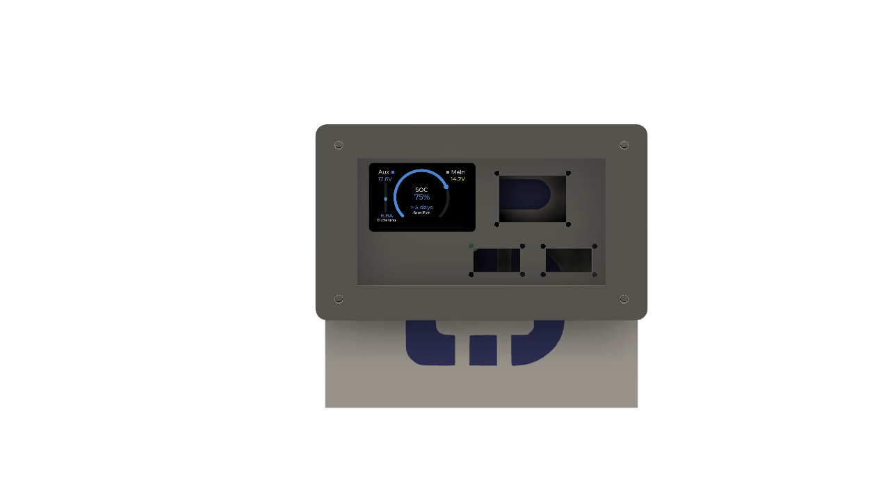
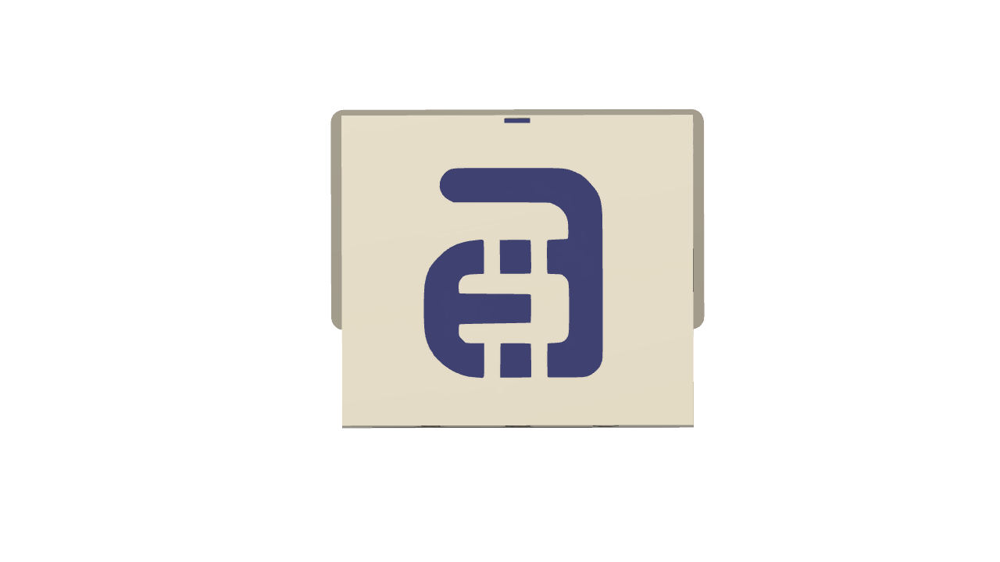
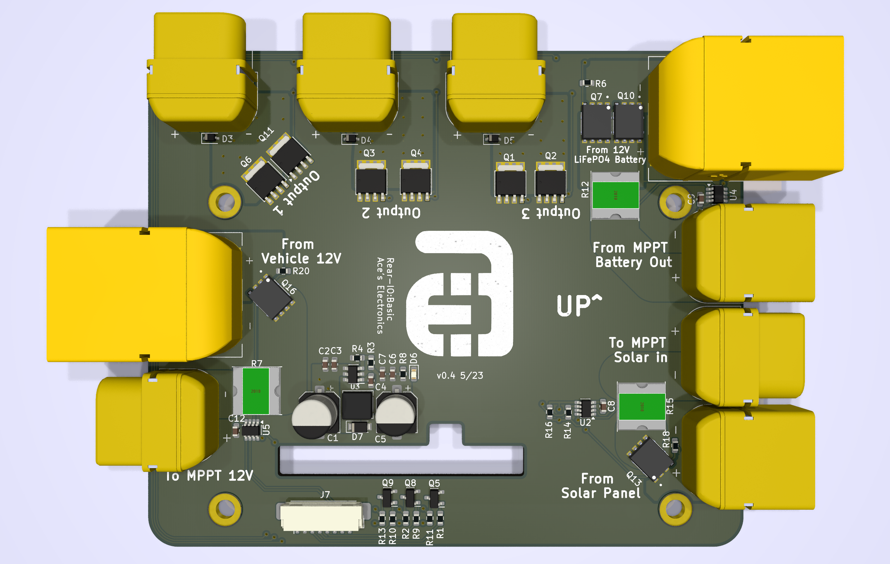
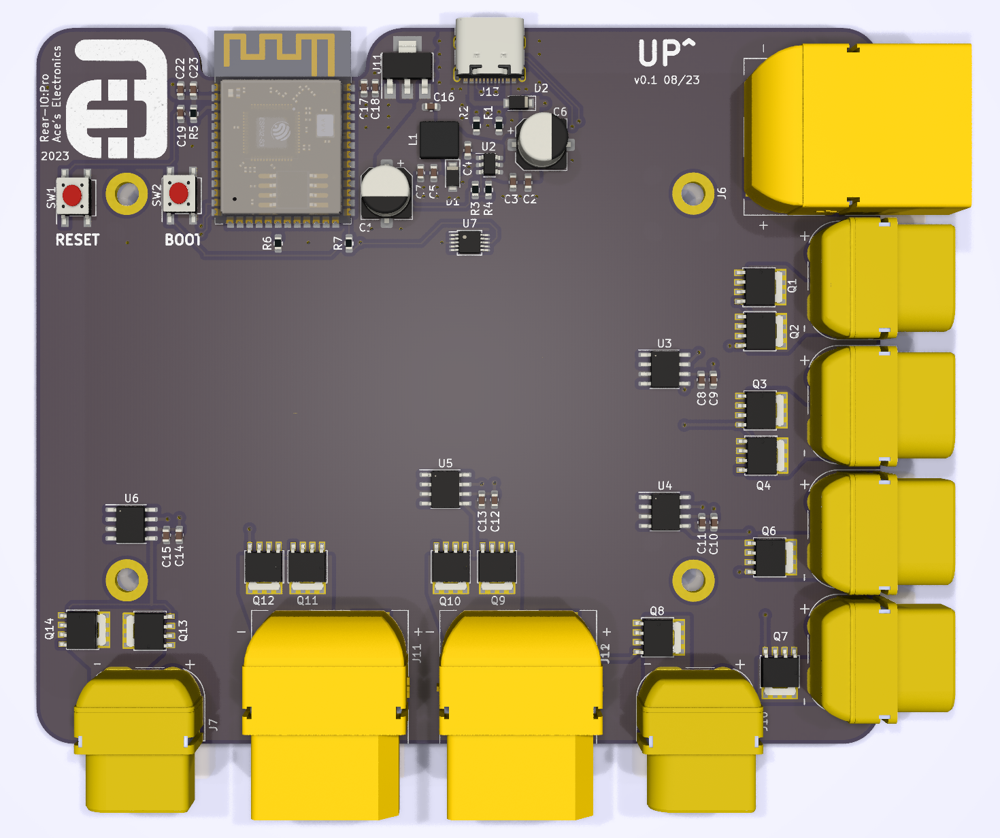

<h1 align="center">
    

  Ace's Electronics Pty Ltd  
  Touchscreen IO Control for P703 Rangers  
</h1>

# TOC:
1. <a href="#goals">Goals</a>
1. <a href="#current-states">Current States</a>
   - <a href="#reario-screen">RearIO: Screen</a>
   - <a href="#reario-battery">RearIO: Battery</a>
   - <a href="#reario-screen-and-battery-cradle">RearIO: Screen and Battery Cradle</a>
   - <a href="#reario-basic-pcb">RearIO: Basic PCB</a>
   - <a href="#reario-pro-pcb">RearIO: Pro PCB</a>
   - <a href="#frontio-screen">FrontIO: Screen</a>
1. <a href="#android-app">Android App</a>
1. <a href="#where-to-buy">Where to Buy</a>
1. <a href="#support">Support</a>
---
# Goals:
The goal of this project is to simplify the placement and connection of a secondary battery in a P703 Ranger, by:  
- Creating a touchscreen interface for stats and control, one in the cab and one in the tub  
- Minimise what's required to supply secondary battery power to things like fridges/freezers, lights, fans etc.
- Minimise what's required to turn things on and off  
- Display voltages/currents/power/load states and run flat times etc.
- Create a minimilist version that will require some externall hardware like an MPPT dual input controller etc.

# Current States:
## RearIO Screen
Screen has been sourced and basic prototype code has been written. Seems workable for now but more work is needed.

Screen (WT32-SC01 Plus):  

Buy:
https://core-electronics.com.au/wt32-sc01-plus-esp32-development-board-with-35-inch-lcd-ips-display-touch-screen.html

Datasheet:
https://www.marutsu.co.jp/contents/shop/marutsu/datasheet/khe_WT32-SC01-PLUS.pdf

Basic GUI example: 
It's a WIP, but here's a taste:  

## RearIO Battery
50Ah battery has een sourced and tested.  

## RearIO Screen and Battery Cradle
The screen and PCB mount is complete. It has cutouts for a marine grade 12v socket + an Anderson socket, and 2 x Anderson sockets.

## RearIO Basic PCB
basic io screenshot The project is currently in the prototyping phase. The PCBs have been sent to JLCPCB and should be here, along with the components, in the next couple of weeks.  
Files: https://github.com/Aces-Electronics/ae-p703-screens/releases/tag/v0.1

## RearIO Pro PCB
The project is in the design stage, and is coming along as time allows.

## FrontIO Screen
Screen has been sourced. No testing has been done yet.
https://www.makerfabs.com/matouch-esp32-s3-parallel-tft-with-touch-1-9-inch.html  

## Android App
Not yet started

# Where to Buy:
TBA

## Support:
Contact me direct via ace<@>aceselectronics.com.au, just make it look like a normal email address. (hiding from the bots ;) )